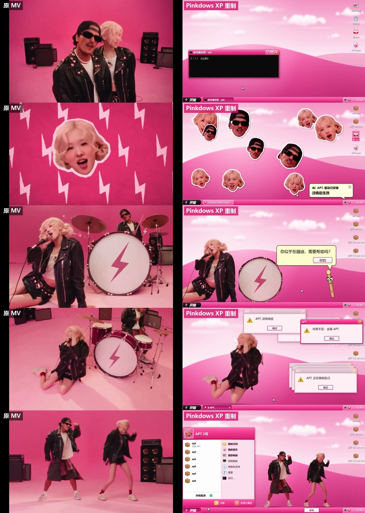

# xp-desktop-mv

一个 Claude Code Skill：把一段 MV 剪辑重做成**节拍同步的 Windows XP 桌面录屏**。人物从原片抠出来，在桌面、窗口、任务栏上唱跳；所有界面都用代码画；每次点击、弹窗、切换都卡在拍子上；界面文案里埋科技圈双关梗。

灵感来自 @anabology 的 BLISS。

## 示例：APT. → Pinkdows XP



- 对比视频：[`examples/apt/comparison.mp4`](examples/apt/comparison.mp4)（左原 MV，右重制，40.8 秒）
- 主梗：歌名 APT. = Linux 的 `apt` 装软件命令。一个粉色的 Windows 不停冒出 apt：`sudo apt install apt` → "将同时安装：鼓 嘴唇 皮衣" → 头像贴纸轰炸 → 任务管理器里全是 apt.exe → "是否结束 APT.？[结束] [继续蹦迪]" → 关机时闪出"正在安装 Ubuntu…"
- 制作：约 2 小时，大约用掉 Claude Max 一个 5 小时额度窗口的 26%
- 审核：6 章各经过 3 轮"美术总监"子 Agent 打分，记录见 [`examples/apt/review_log.md`](examples/apt/review_log.md)

## 用法

1. 把这个仓库放进 Claude Code 的 skills 目录（例如 `~/.claude/skills/xp-desktop-mv/`）。
2. 新建一个项目文件夹，放入 `source.mp4`，再照着 [`references/brief-template.md`](references/brief-template.md) 写一份 `BRIEF.md`（也可以让 Claude 和你一起写）。
3. 在这个文件夹里打开 Claude Code，说："读 BRIEF.md，按步骤做，每到一个检查点停下来给我看。"

需要 Windows、Python 3.12、ffmpeg、Microsoft Edge。有 NVIDIA 显卡的话，抠像会快 8 倍左右。

## 内容

```
SKILL.md        流程：环境 → 梗库 → 分析 → 抠像 → 引擎 → 分章 + 审核循环 → 渲染自检
scripts/        节拍（按底鼓拟合）、镜头 / 黑边、BiRefNet 抠像与清理、无头 Edge 渲染、拼图、编码、自检
engine/         Pinkdows XP 桌面引擎（canvas，drawFrame(t) 是纯函数）
references/     BRIEF 模板、镜头脚本格式、美术总监提示词、踩坑清单
examples/apt/   完整实例：BRIEF、分镜生成器 build.py、定稿分镜、审核记录、对比视频
```

## 版权说明

- 代码和文档由本仓库作者与 Claude 共同编写。
- `examples/apt/` 中的对比视频、对比图和拼图包含歌曲《APT.》（ROSÉ & Bruno Mars）官方 MV 的画面和音频。版权归原权利人所有，这里只用于展示本工具的技术效果，不用于任何商业用途。如果权利人要求，会立即删除。
- 界面中的"Pinkdows""Macrosoft"是戏仿名称，与 Microsoft 无关；没有使用任何真实的 Windows 标志、壁纸或系统音效。
